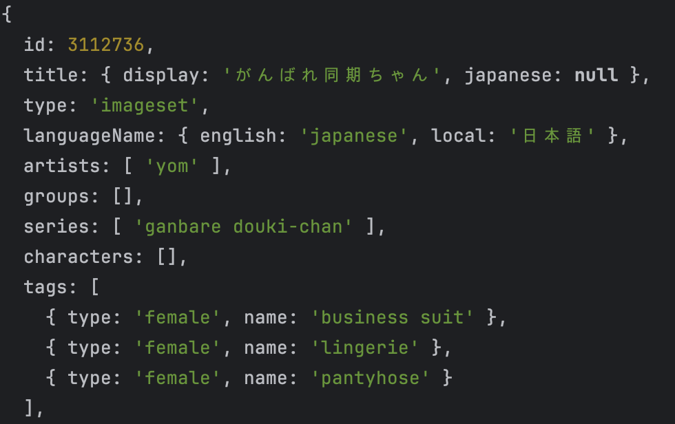

# Description of purpose
<!-- A clear and concise description of what the purpose is -->
Fixes issue with incorrect gender attribution in 
[getGallery](../source/gallery.ts). 

# Description of changes
<!-- A clear and concise description of what the changes are -->
Before:
```typescript
if(responseJson['tags'][i]['male'] === 1) {
	type = 'male';
} else if(responseJson['tags'][i]['female'] === 1) {
	type = 'female';
}
```
After:
```typescript
if(responseJson['tags'][i]['male']?.toString() === '1') {
	type = 'male';
} else if(responseJson['tags'][i]['female']?.toString() === '1') {
	type = 'female';
}
```
Now, it will turn into a string before comparison. We can also use 
`Number.parseInt()` but it will result in a type error. String and Number 
objects both have `toString()` method. And `?` is used for type safety 
when the gender tags are `undefined`.

# Additional context
<!-- Any other context or screenshots about the pull request -->
Before:


After:


Source .js output:\
*Note: `female: "1"` &larr; This would not work with the previous code.*

